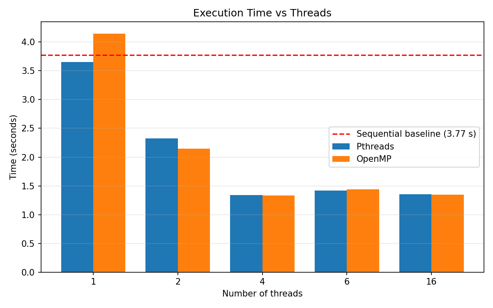
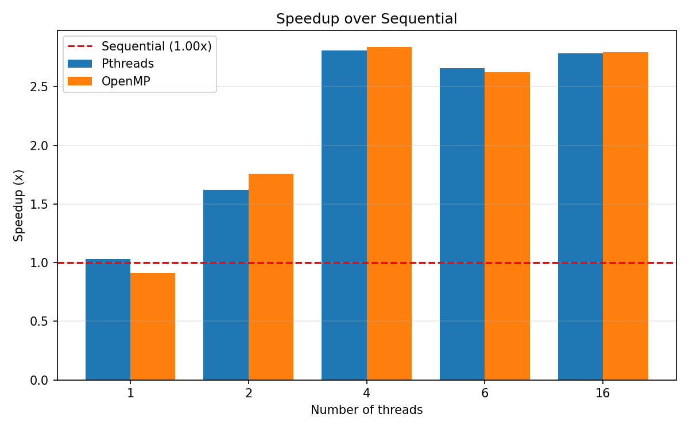
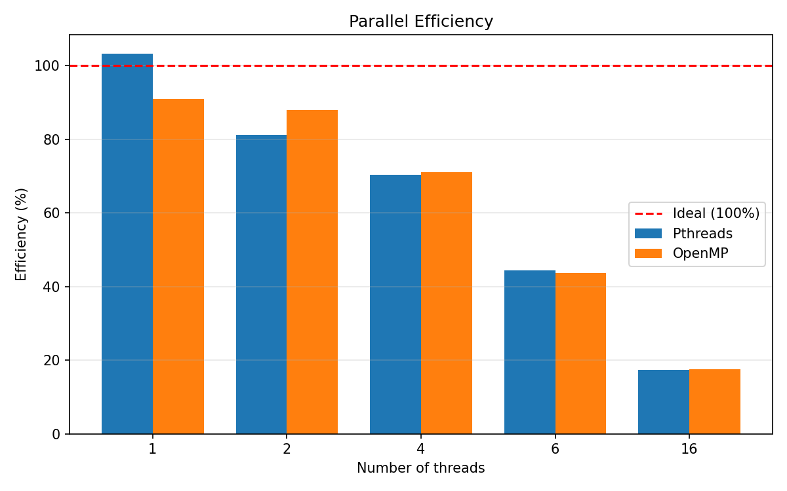
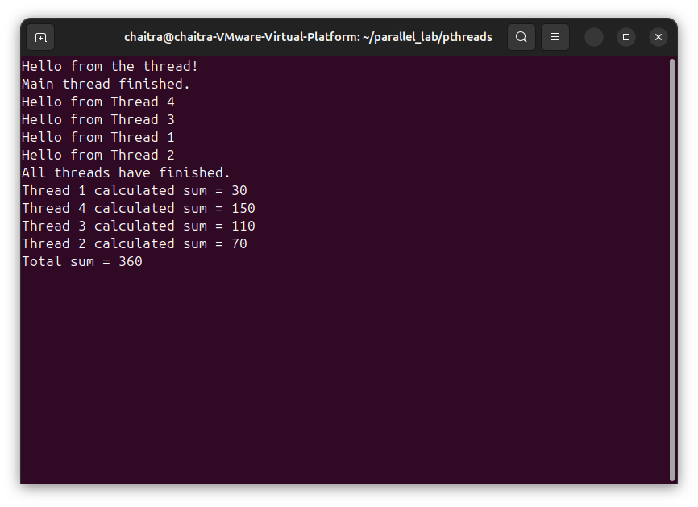
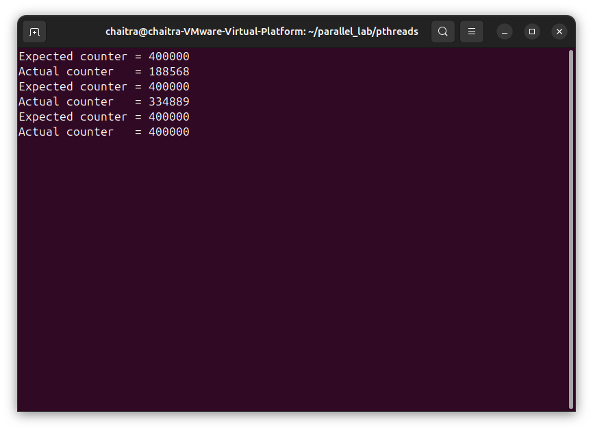
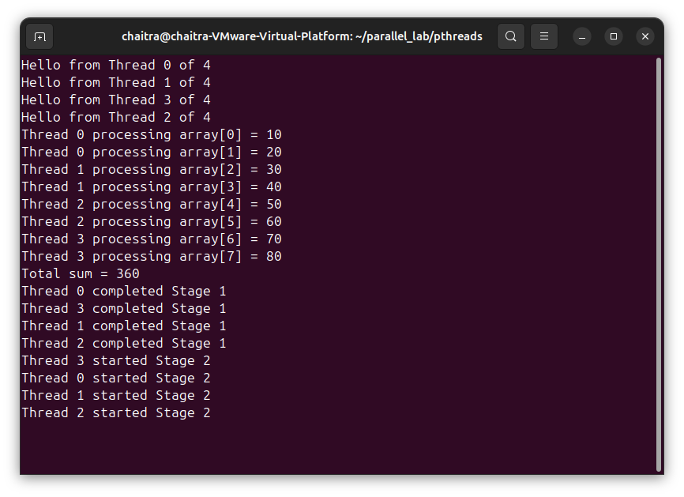
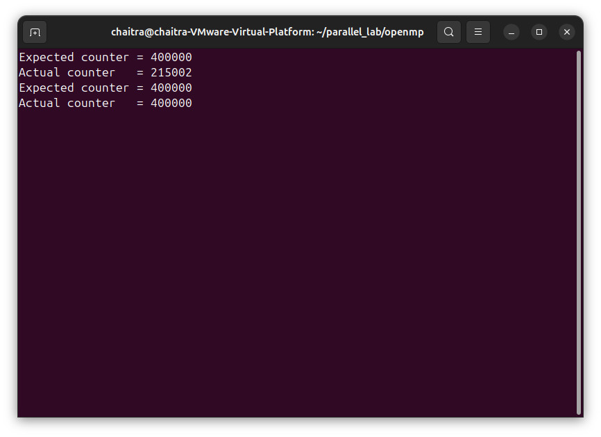
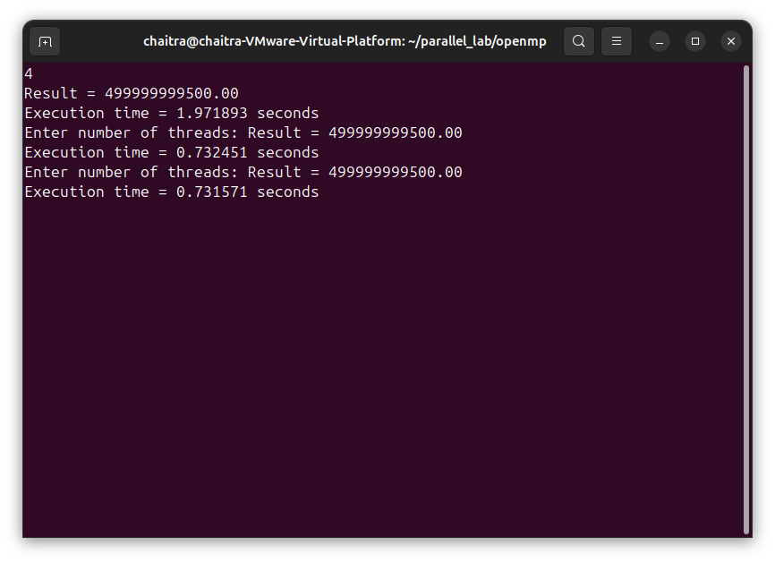

# Experiment 2: Multithreaded Programming
### Pthreads · OpenMP · Race Condition · Synchronization · Performance

**Name:** Chaitra  |  **Roll No:** 253  |  **Course:** PG Parallel Computing

---

## 📌 Aim

To write multithreaded programs in C using **Pthreads** and **OpenMP**, to show a **race condition** and fix it with a **mutex** (Pthreads) and **critical** (OpenMP), to show **barrier** synchronization, and to compare performance for 1, 2, 4, 6 and 16 threads against a sequential baseline.

| # | Part | What it shows |
|---|------|---------------|
| 1 | Pthreads basics | thread creation, passing arguments, join, partial sums |
| 2 | Race condition + mutex | wrong result without locking, correct result with a mutex |
| 3 | OpenMP basics | parallel region, parallel for with reduction |
| 4 | OpenMP race + critical + barrier | same race, fixed with critical, stages with barrier |
| 5 | Performance | sequential vs Pthreads vs OpenMP, speedup and efficiency |

**Performance problem:** sum of `i * 0.000001` for i = 0 to N-1 with N = 1,000,000,000. The correct answer is `499999999500.00`, used as the verification check.

---

## 🖥️ Environment

| Item | Details |
|------|---------|
| Host | Windows with VMware Workstation 17 Player |
| Guest OS | Ubuntu 24.04 64-bit (VM) |
| CPU (VM) | 4 logical CPUs (`nproc` = 4) |
| Compiler | GCC 13.3.0, default flags (no `-O2`) |
| Pthreads | `gcc file.c -o file -pthread` |
| OpenMP | `gcc file.c -o file -fopenmp` |

---

## 📁 Repository Structure

```
EXPT2-PGC/
├── README.md
├── results.txt
├── make_graphs.py
├── pthreads/
│   ├── thread1.c
│   ├── thread2.c
│   ├── thread_sum.c
│   ├── race.c
│   ├── mutex.c
│   └── output_pthreads.txt
├── openmp/
│   ├── omp1.c
│   ├── omp_sum.c
│   ├── omp_race.c
│   ├── omp_critical.c
│   ├── omp_barrier.c
│   └── output_openmp.txt
├── performance/
│   ├── sequential.c
│   ├── pthread_perf.c
│   └── omp_perf.c
├── graphs/
│   ├── execution_time.png
│   ├── speedup.png
│   └── efficiency.png
└── screenshots/
    ├── pthreads_basic.png
    ├── pthreads_race_mutex.png
    ├── openmp_basic.png
    ├── openmp_race_critical.png
    └── performance.png
```

---

## ▶️ How to Compile and Run

```bash
# Pthreads
cd pthreads
gcc thread1.c    -o thread1    -pthread && ./thread1
gcc thread2.c    -o thread2    -pthread && ./thread2
gcc thread_sum.c -o thread_sum -pthread && ./thread_sum
gcc race.c       -o race       -pthread && ./race
gcc mutex.c      -o mutex      -pthread && ./mutex

# OpenMP
cd ../openmp
gcc omp1.c         -o omp1         -fopenmp && ./omp1
gcc omp_sum.c      -o omp_sum      -fopenmp && ./omp_sum
gcc omp_race.c     -o omp_race     -fopenmp && ./omp_race
gcc omp_critical.c -o omp_critical -fopenmp && ./omp_critical
gcc omp_barrier.c  -o omp_barrier  -fopenmp && ./omp_barrier

# Performance (asks for the number of threads)
cd ../performance
gcc sequential.c   -o sequential
gcc pthread_perf.c -o pthread_perf -pthread
gcc omp_perf.c     -o omp_perf     -fopenmp
./sequential
./pthread_perf
./omp_perf
```

---

## 📊 Results

### Part 1: Correctness and synchronization

| Program | Expected | Actual | Result |
|---------|----------|--------|--------|
| thread_sum (4 threads) | 360 | 360 (30 + 70 + 110 + 150) | ✅ Correct |
| race (Pthreads, no lock) | 400000 | 372066 and 307008 (two runs) | ❌ Race condition |
| mutex (Pthreads, with lock) | 400000 | 400000 | ✅ Correct |
| omp_sum (reduction) | 360 | 360 | ✅ Correct |
| omp_race (no protection) | 400000 | 315964 | ❌ Race condition |
| omp_critical (critical) | 400000 | 400000 | ✅ Correct |

`omp_barrier`: all four threads printed "completed Stage 1" before any thread printed "started Stage 2".

### Part 2: Performance

Sequential baseline: five runs of 3.331169, 3.822338, 3.496280, 4.020941 and 4.199273 s, average **3.774000 s**.

| Threads | Pthreads time (s) | Speedup | Efficiency | OpenMP time (s) | Speedup | Efficiency |
|---------|-------------------|---------|------------|-----------------|---------|------------|
| 1  | 3.655563 | 1.03× | 103.2% | 4.145702 | 0.91× | 91.0% |
| 2  | 2.325327 | 1.62× | 81.1%  | 2.145581 | 1.76× | 87.9% |
| 4  | 1.342439 | 2.81× | 70.3%  | 1.328977 | 2.84× | 71.0% |
| 6  | 1.419750 | 2.66× | 44.3%  | 1.439114 | 2.62× | 43.7% |
| 16 | 1.355168 | 2.78× | 17.4%  | 1.349932 | 2.80× | 17.5% |

**Speedup** = sequential time / parallel time  |  **Efficiency** = (speedup / threads) × 100

---

## 📈 Performance Graphs

### Execution Time


### Speedup over Sequential


### Parallel Efficiency


---

## 📷 Screenshots

### Pthreads



### OpenMP



### Performance


---

## 🔍 Observations

- **Race condition:** `counter++` is not one step. It is load, add and store. When 4 threads do this at the same time, updates overwrite each other, so the counter ended below 400000 (372066 and 307008 with Pthreads, 315964 with OpenMP) and changed on every run.
- **Fix:** a Pthreads mutex and an OpenMP critical section let only one thread update the counter at a time. Both gave exactly 400000.
- **Scaling:** time dropped from about 3.7 s (1 thread) to about 1.34 s at 4 threads, a speedup of about 2.8×. This is the best result because the VM has 4 logical CPUs.
- **6 and 16 threads:** no improvement over 4 threads (about 1.35 to 1.44 s). With only 4 CPUs, extra threads just wait for a core and add scheduling overhead, so efficiency fell to about 44% at 6 threads and about 17% at 16 threads.
- **Not perfectly linear:** 4 threads gave 2.8× instead of 4× because the VM's virtual CPUs are shared with the host and other programs. The five sequential runs varied from 3.33 to 4.20 s, so timings on this VM are noisy.
- **Pthreads vs OpenMP:** performance was almost the same (1.342 s vs 1.329 s at 4 threads). OpenMP needs far less code, for example `parallel for reduction` replaces manual thread creation, chunking and joining.
- **OpenMP at 1 thread** was slightly slower than the sequential baseline (0.91×) because of the OpenMP runtime overhead and run-to-run noise.

---

## ✅ Conclusion

Multithreaded programs were written with Pthreads and OpenMP. The unsynchronized counter produced wrong results, and a mutex (Pthreads) and critical (OpenMP) fixed it. For the 1,000,000,000-iteration sum, both models gave a speedup of about 2.8× with 4 threads on the 4-CPU VM, and using more threads than CPU cores gave no further gain and lowered efficiency. Pthreads gives low-level control, while OpenMP gives the same performance with much simpler code.

---

*Experiment 2 · Parallel Computing Lab*
